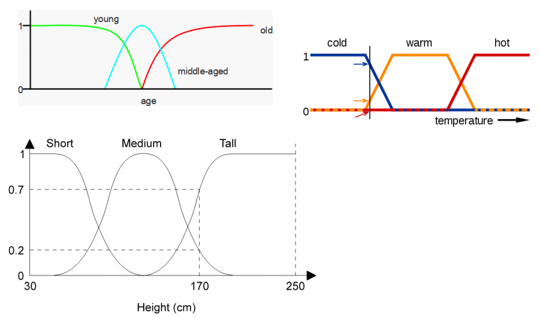

# Fuzzy Logic 

Fuzzy logic is a type of logic that recognizes more than simple true or false values.

With fuzzy logic propositions can be represented with degrees of truthfulness or falsehood.

- Traditional Logic is true or false
  - 0 or 1 
  - Can't be in-between

However, the world isn't black or white, reality isn't that precise

#####Greedy(Richard)⊂ [0,1] 

* Richard is either Greedy or he isn't 

##### But What if Richard is only somewhat greedy?

* Fuzzy variables have values in the range of [0,1]
  * e.g. Greedy(Richard) = 0.7
  * King(Richard) = 1

#### Terminology 

##### Universe of discourse

* Also just called universe
* The range of values a variable can take
* e.g. [10, 110] for temperature
* whatever is appropriate for the application

##### Linguistic Terms

* The 'words' used to describe the concepts over the universe
* e.g. freezing, cold, cool, warm, hot
* these become our fuzzy sets

| Linguistic Variable | Universe of Discourse | Linguistic Terms          |
| ------------------- | --------------------- | ------------------------- |
| Temperature         | [-30,30]              | Freezing, cool, warm, hot |
| Speed               | [0,250]               | slow, fast                |
| Age                 | [0,120]               | young, middle-aged, old   |

## Membership Functions

------

#### Fuzzy Variables

* Fuzzy linguistic variables are used to represent concepts spanning a particular spectrum/range
  * e.g. Temp{Freezing, Cool, Warm, Hot}
* Membership function µ 
  * For any fuzzy set A: µ~A~(x)associates each element x with a membership value in [0,1]
    * e.g. fuzzy set warm 
      * if x=22°C µ~warm~(x) = µ~warm~(22°C) = 0.75 

Consider the fuzzy set Temp{Freezing, Cool Warm, Hot}

* Degrees of truth of membership
* For a given x we can find:
  * µ~freezing~(x)
  * µ~cool~(x)

How cold is 2.5°C

* µ~cool~(2.5°C) = 0.3
* µ~freezing~(2.5°C) = 0.7

#### Where do these number come from?

It depends on the defined shape of the fuzzy shape

* Trapezoids are often used