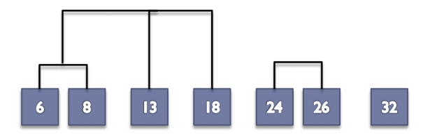
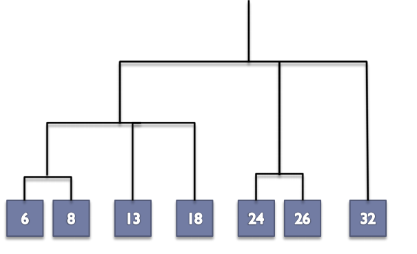

# Clustering

------

[TOC]

Clustering is the process of grouping a set of objects into classes of similar objects.

It is the most common form of unsupervised lerning

* Unsupervised learning is the act of learning from raw data

## Clustering Algorithms

* Partitional algorithms
  * Usually start with a random (partitial) partitioning
  * Refine it iteratively
    * K-means clustering
    * Model-based clustering
* Hierarchical algortithms
  * Bottom-up, agglomerative
  *  Top-down, divisive

## K-means Algorithm

* A partitional algortihm
* Operates using centroids
  * A centroid is a point in the data that is considered to be the center of the data
* Start by picking k, the number of clusters
* Initialise clusters by picking one point per cluster (seeds)
  * e.g. pick data points at random
  * Could also generate these randomly

### Populating Clusters

* Iterate until converged (centroid positions don't change from one iteration to another)
  * Computer the **distance** from all data points to all k centroids
  * For each **data point**, assign it to the cluster whose current centroid is nearest
  * For each **centroid**, compute the average (mean) of all points assigned to it
  * Replace the k centroids with teh new averages

### Terminitation Conditions

* A fixed number of iterations
* Centroid positions don't change (can be proven to converge)
* Clusters look reasonable

## Initial Seed Choice

* The final results can can vary based on the choice of initial centroids
* Some seeds can result in poor **convergence rates** or convergence to sub-optimal clustering

## Hierarchical Clustering

### Algorithms

* Agglomerative (bottom up)
  * Start with each data point being a single cluster
  * Merge based on closeness/distance
  * Eventually all data points belong to the same cluster
* Divisive (top-down)
  * Start with all data points belonging to the same cluster
  * Split up based on distance
  * Eventually each node forms a cluster on its own
* Good
  * Does not require the number of cluster k in advance
* Bad
  * Requires a termination/readout condition

### Hierarchical Agglomerative Clustering

* Assumes a similarity measure for determining the similarity of two data points
  * =Distance function from before
* Start with all points in seperate clusters
  * Then repeaatedly joins the clusters that are most similar until there is only one cluster
* The histoy of merging forms a tree or hierarchy

#### Basic Algortihm

* Compute the distance matrix (= distance between **any** 2 data points)
* let each data point be a cluster
* Repeat
  * Merge the two (or more) closest clusters
  * Update the distance matrix
* Untill only a single cluster remains

#### Closest Pair of Clusters

There are many variants of defining closest pair of clusters

##### Single-link

* Distance of the closest points
* Use minimum distance of pairs of data points
* Can result in straggly clusters due to a chaining effect

###### Example

* Compute the distance matrix
* Find the two smallest distances which in this case are 6 and 8, 24 and 26
* This makes the dendogram look like:
  

* Now recompute the distance matrix using the new points

* 13, 18, 6 and 8 are now all one point 

* Form a new distance matrix

* 24, 26 is closest to 6,8,13 and 18 
* 32 is closest to 24,26

* The user can then chop the tree to form a certain number of clusters 

##### Complete-link

* Distance of the furthest points
* Use maximum distance of pairs
* Maxes "tighter" spherical clusters that are typically preferable
* 1D data {1,3,8,9,10}
* Complete link clustering is 9
  * The distance between 1 and 10
  * = two furthest points across the clusters
* Compute the distance matrix (= distance between any 2 points)
* Let each data point be a cluster
* Repeat
* Merge the two (or more) closest clusters
* Update the distance matrix
* Until only a single cluster remains

##### Centroid

* Distance of the centroids (centers of gravity)

##### Average-link

* Average distance between pairs of elements

### HAC Critique

#### Advantages
* K not required at the start
* A hierarchy is obtained
* Many possible clusterings can be derived

#### Disadvantages
* Where to slice the dendogram? (cluster validity measure might
help here though)
* Complexity 
* Which choice of linkage? 

### Time Complexity
 * In the first iteration all HAC methods need to compute similarity of all pairs of n individual data points = O(dn^2^)

* In each of the subsequent merging iterations
  * Compute the distance between the most recently created cluster(s) and all other existing clusters
* Maintaining a heap of distances allows this to be O(dn^2^log(n))
  * So not as fast as k-means