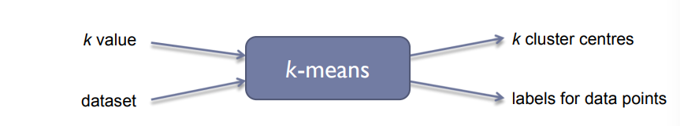

# Clustering

------

[TOC]

Clustering is the process of grouping a set of objects into classes of similar objects.

It is the most common form of unsupervised lerning

* Unsupervised learning is the act of learning from raw data

## Clustering Algorithms

* Partitional algorithms
  * Usually start with a random (partitial) partitioning
  * Refine it iteratively
    * K-means clustering
    * Model-based clustering
* Hierarchical algortithms
  * Bottom-up, agglomerative
  *  Top-down, divisive

## K-means Algorithm

* A partitional algortihm
* Operates using centroids
  * A centroid is a point in the data that is considered to be the center of the data
* Start by picking k, the number of clusters
* Initialise clusters by picking one point per cluster (seeds)
  * e.g. pick data points at random
  * Could also generate these randomly

### Populating Clusters

* Iterate until converged (centroid positions don't change from one iteration to another)
  * Computer the **distance** from all data points to all k centroids
  * For each **data point**, assign it to the cluster whose current centroid is nearest
  * For each **centroid**, compute the average (mean) of all points assigned to it
  * Replace the k centroids with teh new averages

### Terminitation Conditions

* A fixed number of iterations
* Centroid positions don't change (can be proven to converge)
* Clusters look reasonable