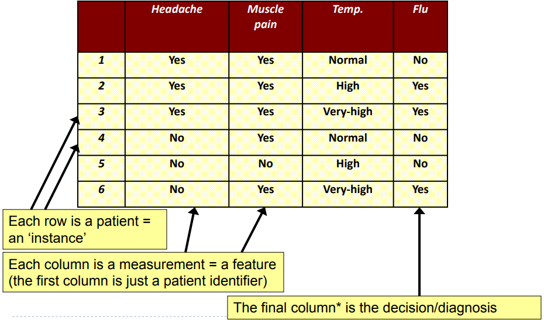
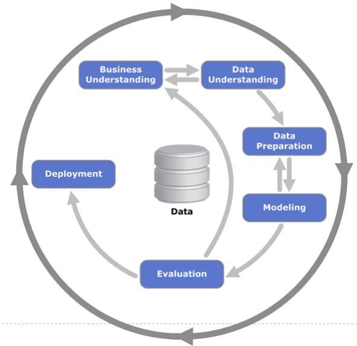
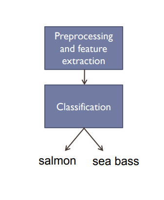
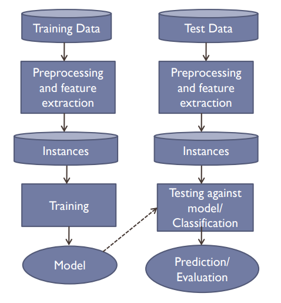
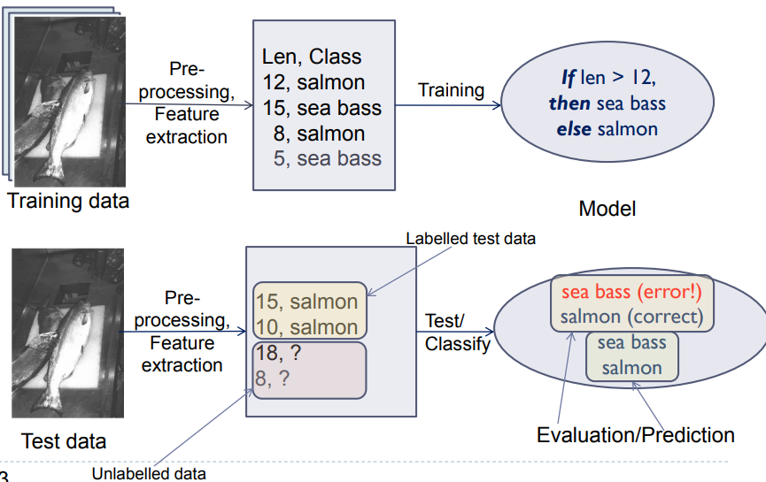
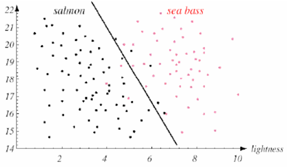
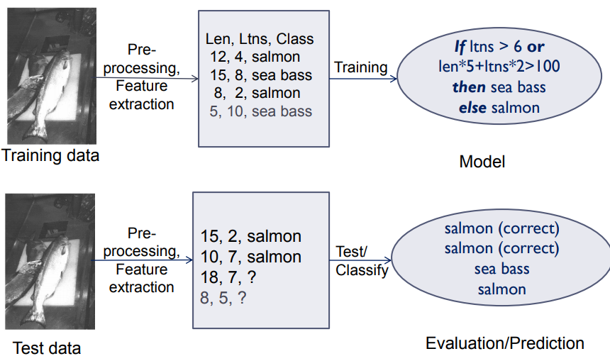
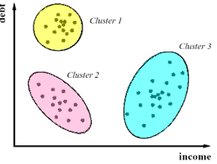

# Data Mining Overview

------

[TOC]

## What is it?#

The extraction of **interesting** (non-trivial, implicit, previously unknown and potentially useful) information or patterns from data in large databases.

The process of discovering **meaningful** new correlations, patterns and trends by sifting through large amounts of data stored in reposotories using AI as well as statistical and mathmatical techniques.

## Why Data Mine?

* Lots of data is being calculated
* Computers have become cheaper and more powerful
  * So we are now able to mine data and find new information
* Can improve your business
  * Customer who bought this also bought...
  * Everyone else is doing it so by not doing it you're being left out
* Can help scientists 
  * In classifying and segmenting data
  * In hypothosis formation/testing

## What Does Data Look Like?

* For each patient a number of measurements are taken
* Used to predict wether thy have the flu

## Crisp Data Mining

##### Business Understanding

As a business understand what information you want to get out of your data.

##### Data Understanding 

Understanding what it is that you want to get out of the data and what data is available to the business.

##### Data Preperation

Sometimes you have to change the format of the data because it's not usable directly. Sometimes there is missing data and this needs to be dealt with, it might also involve noise removal/reduction

##### Modeling

The technique you're using:

* Clustering
* Classification
* Association

The "magic box" that actually gives you the information

##### Evaluation

Making sure what you've got is actually good

##### Deployment

Eventually you do what you set out to do

##### In Practice

Data understanding and preperation are the most important because if you fedd in the wrong infomation you will get the wrong stuff back

## Classification

* Learning models to predict classes
* givien a collection of records/instances (training set) where each record contains a set of features one of the features is the class. We want to find a model for the class feature as a function of the values of other features.
* Goal: 
  * Previously unseen instance should be assigned a class as accurately as possible 

### Example

* A fish packing plant wants to automate the process of sorting incoming fish according to species 
* Features used to distinguish the fish
  * Length
  * Width
  * Lightness
  * Positions of body parts
  * etc...

####Preprocessing

  * Image of the fish is isolated from each other and the background

####Feature extraction

  * Measure features/properties

####Classification

  * The values of these features are passed to a classifier that evaluates the evidence presented and builds a model to discriminate between the two species

####Domain knowledge

  * A sea bass is longer than a salmon
    * Related feature
      * Length
  * Training the classifier
    * Some examples are passed to the classifier and the classifier learns how to distinguish salmon from sea bass
  * Classification model
    * The classifier generates a model from the training data
    * An example model is
      * If length >= num 
        * Then sea bass otherwise it's salmon
        * Where num is learned by the classifier
  ####So the overall classification process goes like this:

  

  

#### Why was there an error?

* Insufficient training data
* Too few features
* Too many/irrelevant features
* Overfitting (Learning too much)

####Decision Rule

Classify new instance as sea bass if it falls on the right of the line otherwise it's salmon.

This new model is better the classifier is better, there are fewer incorrect classification.

### Calssification Approach 1

#### Direct Marketing

##### Goal

Reduce the cost of mailing adverts by only targeting a set of consumers likely to buy a new mobile phone product

##### Approach

* Use the data for a similar product introduced before
* We know which customers decided to buy or not buy
* This {buy, don'y buy} decision forms the class feature
* use this info to build a class model

## Clustering 

Given a set of data points find clusters using a similarity measure such that:

* Data points in one cluster are more similar to another
* Data points in seperate clusters are less similar to another

