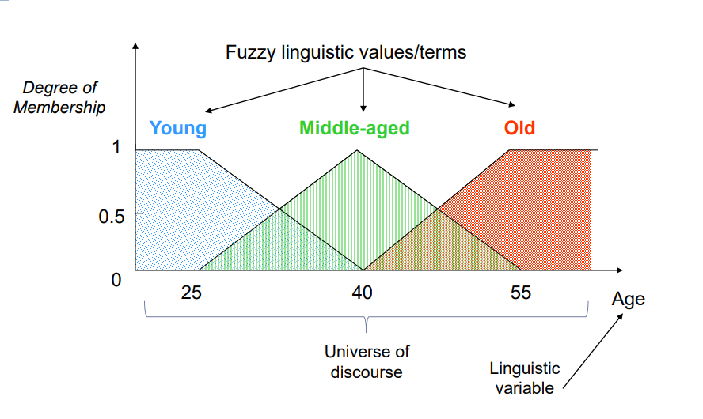
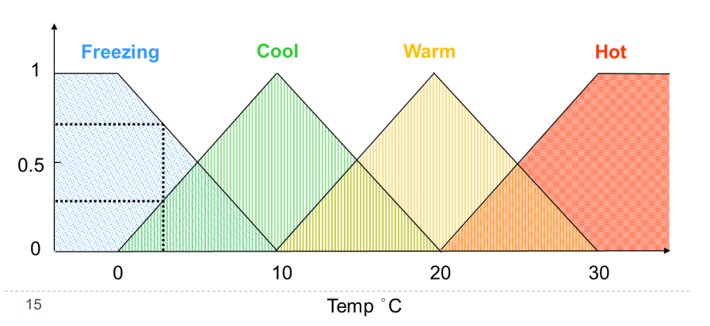
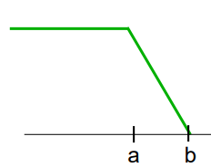
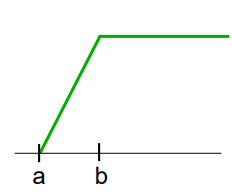
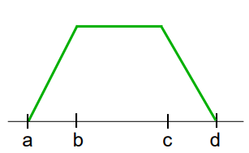
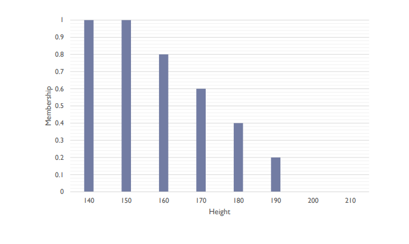
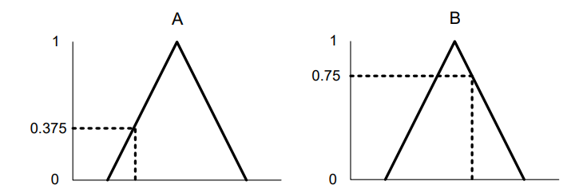
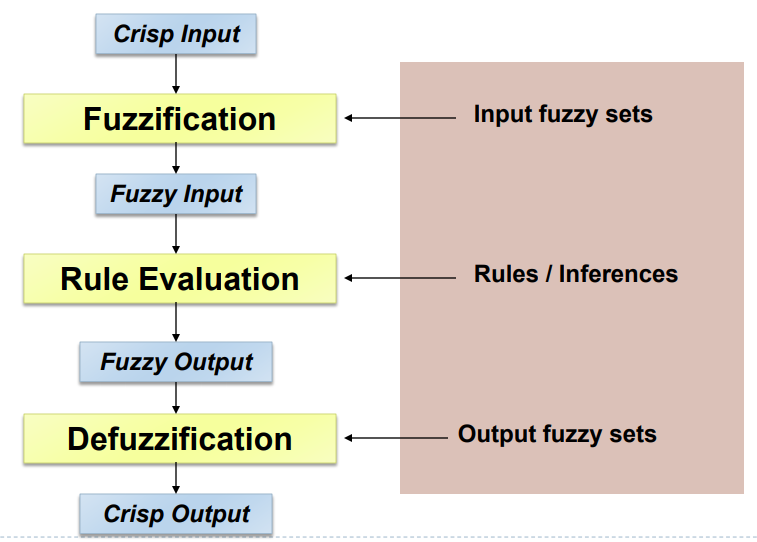
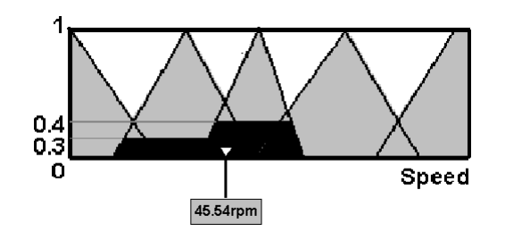

# Fuzzy Logic

Fuzzy logic is a type of logic that recognizes more than simple true or false values.

With fuzzy logic propositions can be represented with degrees of truthfulness or falsehood.

- Traditional Logic is true or false
  - 0 or 1 
  - Can't be in-between

However, the world isn't black or white, reality isn't that precise

##### Greedy(Richard)⊂ [0,1]

- Richard is either Greedy or he isn't 

##### But What if Richard is only somewhat greedy?

- Fuzzy variables have values in the range of [0,1]
  - e.g. Greedy(Richard) = 0.7
  - King(Richard) = 1

## Terminology

------

##### Universe of discourse

- Also just called universe
- The range of values a variable can take
- e.g. [10, 110] for temperature
- whatever is appropriate for the application

##### Linguistic Terms

- The 'words' used to describe the concepts over the universe
- e.g. freezing, cold, cool, warm, hot
- these become our fuzzy sets

| Linguistic Variable | Universe of Discourse | Linguistic Terms          |
| ------------------- | --------------------- | ------------------------- |
| Temperature         | [-30,30]              | Freezing, cool, warm, hot |
| Speed               | [0,250]               | slow, fast                |
| Age                 | [0,120]               | young, middle-aged, old   |

## Membership Functions

------

#### Fuzzy Variables

- Fuzzy linguistic variables are used to represent concepts spanning a particular spectrum/range
  - e.g. Temp{Freezing, Cool, Warm, Hot}
- Membership function µ 
  - For any fuzzy set A: µ~A~(x)associates each element x with a membership value in [0,1]
    - e.g. fuzzy set warm 
      - if x=22°C µ~warm~(x) = µ~warm~(22°C) = 0.75 

Consider the fuzzy set Temp{Freezing, Cool Warm, Hot}

- Degrees of truth of membership
- For a given x we can find:
  - µ~freezing~(x)
  - µ~cool~(x)

How cold is 2.5°C

- µ~cool~(2.5°C) = 0.3
- µ~freezing~(2.5°C) = 0.7

###### Where do these number come from?

It depends on the defined shape of the fuzzy shape

- Trapezoids are often used

## Trapezoidal membership function

##### Left Trapezoid

###### Case 1: $x<=a$

- Membership value =  1

###### Case 2: $x>=b$

- Membership value  = 0

###### Case 3: $a<x<b$

- Membership value = $\dfrac{b-x}{b-a}$

##### Right Trapezoid

###### Case 1: $x<=a$

- Membership value =  0

###### Case 2: $x>=b$

- Membership value  = 1

###### Case 3: $a<x<b$

- Membership value = $\dfrac{x-a}{b-a}$

##### Regular Trapezoid

###### Case 1: $x<=a$ OR $x >= d$

- Membership value =  0

###### Case 2: $x>=b$ AND $x<=C$

- Membership value  = 1

###### Case 3: $x >=a$ AND $x <= b$

- Membership value = $\dfrac{x-a}{b-a}$

###### Case 3: $x >=c$ AND $x <= $d$

- Membership value = $\dfrac{d-x}{d-c}​$

All of these can come down to:

- $f(x;a,b,c,d) = max(min(\dfrac{x-a}{b-a},1,\dfrac{d-x}{d-c}),0)$

##### Alternative Representation

- Fuzzy sets can be represented in vector notation

  - This is more useful for discrete rather than real valued universe

  - A = (x~1,~µ~A~(x~1~)),(x~2,~µ~A~(x~2~)), (x~3,~µ~A~(x~3~)) ...)

  - Visually this looks like (for a short height set):

    

### Fuzzy Conjunction (AND)

- A ∧ B = min(A,B)

  

- µ~A~(x) ∧ µ~B~(y) = min(0.375, 0.75) = 0.375

- When you're using AND you only want the intersecting area

When using AND on two fuzzy sets they must both have the same universe (range of values)

### Fuzzy Disjunction (OR)

- A ∨ B = max (A,B

- µ~A~(x) ∨ µ~B~(y) = max (0.375, 0.75) = 0.75

- When using OR on a fuzzy set you get all of the area

When using OR the sets must both have the same universe (range of values)

### Fuzzy Negation

- ¬ A = 1-A

- Models the NOT operator in logic

  

- µ~¬A~(x) = 0.625

- µ~¬B~(x) = 0.25

- The negation of a fuzzy set is composed of all element negations

## Fuzzy Inference

------

- Like traditional logic we want to perform inference

  - i.e. drawing conclusions from data
    - IF A then B
    - IF A AND B THEN C

  ### Fuzzy systems: overview

### Mamdani Fuzzy Systems

- Given a set of fuzzy rules and a new input to classify, the process is:
  - Fuzzification:
    - Find memberships of input(s) to fuzzy sets
  - Rule evaluation (inference):
    - Use memberships to calculate firing strength of rules
  - Composition/defuzzification:
    - Aggregate across the rules to form an output fuzzy set using the firing strength, then obtain an output value(defuzzify)

#### Setting up the System

- Establish the "fact" base of the fuzzy system 
  - Identify the input and output of the system and fuzzy set names
  - Define appropriate IF-THEN rules
  - Use RAW data to derive membership functions

#### Example Air Conditioner

- Define linguistic terms (fuzzy sets) for temperature
  - COLD, COOL, PLEASENT, WARM and HOT
- The speeds of the motor controlling the fan has the graduations
  - MINIMAL, SLOW, MEDIUM FAST and BLAST
- The rules are:

| Rule 1 | IF   | temp is coLD     | THEN | speed is minimal |
| :----- | :--- | ---------------- | ---- | ---------------- |
| RULE 2 | IF   | TEMP IS COOL     | THEN | SPEED IS SLOW    |
| RULE 3 | IF   | TEMP IS PLEASENT | THEN | SPEED IS MEDIUM  |
| RULE 4 | IF   | TEMP IS WARM     | THEN | SPEED IS FAST    |
| RULE 5 | IF   | TEMP IS HOT      | THEN | SPEED IS BLAST   |

- The temperature graduations are related to a persons perceptions of ambient temperature

| Temp (°C) | COLD   | COOL   | PLEASENT | WARM   | HOT    |
| --------- | ------ | ------ | -------- | ------ | ------ |
| 0         | **Y*** | N      | N        | N      | N      |
| 5         | **Y**  | **Y**  | N        | N      | N      |
| 10        | N      | **Y**  | N        | N      | N      |
| 12.5      | N      | **Y*** | N        | N      | N      |
| 15        | N      | **Y**  | N        | N      | N      |
| 17.5      | N      | N      | **Y***   | N      | N      |
| 20        | N      | N      | N        | **Y**  | N      |
| 22.5      | N      | N      | N        | **Y*** | N      |
| 25        | N      | N      | N        | **Y**  | N      |
| 27.5      | N      | N      | N        | N      | **Y**  |
| 30        | N      | N      | N        | N      | **Y*** |

##### Where

- Y - temp value that belongs to set A (0<µ~A~(x)<1)
- Y* - temp value that is the ideal member of set A µ~A~(x) = 1
- N - temp value that is not a member of set A µ~A~(x) = 0

##### The triangular membership for the fuzzy sets for temperature are:

| Temp (°C) | COLD   | COOL   |
| --------- | ------ | ------ |
| 0         | **Y*** | N      |
| 5         | **Y**  | **Y**  |
| 10        | N      | **Y**  |
| 12.5      | N      | **Y*** |
| 15        | N      | **Y**  |
| 17.5      | N      | N      |
| 20        | N      | N      |
| 22.5      | N      | N      |
| 25        | N      | N      |
| 27.5      | N      | N      |
| 30        | N      | N      |

- Cold
  - valid from 0 to 10
  - for 0 ≤ t ≤ 10 
    - $µ~cold~(t) = \dfrac{-t}{10} +1$
- Cool
  - valid from 0 to 17.5
    - for 0 ≤ t ≤ 12.5 
      - $µ~cool~(t) = \dfrac{-t}{12.5} $
    - for 12.5 ≤ t ≤ 17.5 
      - $µ~cool~(t) = \dfrac{-t}{5} + 3.5 $
- All based on the linear equation y = ax + b

##### Thoughts on this system

- It is subjective
  - When one person thinks it's cold it might not match what I think is cold
  - Therefore a controller built for them might not be right for me
- It is tuneable
  - Fiddle with the fuzzy set membership functions to get better performance
- Fuzzy sets allow for some flexibility here
  - Might not get perfect definitions straight away but will probably be good enough

### Fuzzification

For this module you'll be given the fuzzy sets and rules

- fuzzification is then just taking the crisp/raw input values and putting these into the fuzzy sets to obtain the membership values
- The membership values are  used in the rest of the system

#### Rules

- Fuzzy rules look like ordinary rules but use fuzzy variables and sets 
  - Temperature = fuzzy variable
  - Cool = fuzzy set
  - Hot = fuzzy set
  - If temperate is cool then ...
  - The system takes a measurement and finds that the current temperature is Cool to degree 0.3… 
- Fuzzy inference must take into account these memberships and reason using them
  - It evaluates all rules and determines their truth values/memberships
  - If an input does not precisely correspond to an IF-THEN rule, partial matching of the input data is used

##### Interpreting Rules

* IF A AND B THEN C
  * A = 0.7
  * B = 0.2
  * Take the min (because of AND) of 0.7 and 0.2 which is 0.2
  * C = 0.2
* IF A OR B THEN C 
  * A = 0.7
  * B = 0.2
  * Take the max (because of OR) of 0.7 and 0.2 which is 0.7
  * C = 0.7

##### Composition (aggregation)

* Typically there are lots of rules and each one will fire to a degree 
* Composition is the process of combining all these fuzzy conclusions into a single conclusion for each fuzzy set

##### Defuzzification

* Convert the value obtained from composition into a "crisp" value

* Depending on the application either output the best matching fuzzy set label or output a number

* We need to get from our fuzzy set to a real number

  * Centre of Gravity (CoG)

    * Find the centre of gravity of the membership function for the fuzzy set

    * $x=\dfrac{\sum_{i=1}^{n}x~i~ * µ~(xi)~}{\sum_{i=1}^{n} µ~(xi)~}$

    * ###### Where

      * x~i~ = i^th^ element of the aggregate fuzzy set
      * µ~(xi)~ = membership value of x~i~ 
      * n = number of elements in the output fuzzy set

* Maximum 

  * One of the variable values at which the composed fuzzy set has it's maximum truth value is chosen as the crisp value for the output variable

* Given the fuzzy output

  

* The first-of-maximum, middle-of-maximum and las-of-maximum would be -2,-5 and -8 respectively

* ###### Calculate the centre of gravity for the area

  * Bisector method
    * Finds the value where the area on one side of that value is equal tot he area on the other side
    * This isn't needed for the exam

##### Example: Air Conditioner

* Considering a temperature of 16°C

* Operation of a fuzzy rule based system

    1. Fuzzification
    	2. Rule evaluation/inference
    	3. composition/defuzzification

* 16°C only affects cool and pleasent

  * µ~cool~(16.5) = 0.3
  * µ~pleasent~(16.5) = 0.4
  * 0 to all other sets
  * These are got from reading off the graph

* Rules

  * RULE 1: IF temp is cold THEN speed is minimal 
  * RULE 2: IF temp is cool THEN speed is slow 
  * RULE 3: IF temp is pleasant THEN speed is medium 
  * RULE 4: IF temp is warm THEN speed is fast 
  * RULE 5: IF temp is hot THEN speed is blast

* These only match rules 2 and 3

  * Speed is slow to 0.3 (Rule 2)
  * Speed is medium to 0.4 (Rule 3)

* Defuzzification

  * 

* Centre of gravity approach

  * For continuous universes what you tend to do is take a number of sample points at regular distacnes starting at the min, which in this case is 12.5, and then incrementing by a number, such as 2.5 for this, up untill you reach a point of no membership
  * For each element you see how much it belongs to each fuzzy set

* This method is not used on the exam only the discrete approach is

#### Hedges

* Used to modify fuzzy sets
* by modelling things with words like very, somewhat, extremely etc...

## Discrete approach

------

* A simpler approach that you need to know and apply
* Memberships are given as vector fuzzy sets
* Same process as before to perform reasoning
  * Fuzzification
  * Rule evaluation/Inference
  * Composition/defuzzification

## Vector Representation Approach

1. fuzzification
   1. Take the crisp inputs and get memberships
2. Inference
   1. Plug memberships into fuzzy rule antecedents
   2. These are the firing strengths
   3. Chop each consequent/output fuzzy set using this (i.e. min)
3. Composition
   1. MAX the output fuzzy sets togeher to get final output fuzzy set
4. Defuzzification (CoG)
   1. CoG = $\dfrac{sum~of(memberships*elements)}{sum~of~memberships}$
      1. e.g. $\dfrac{0.5*1+0.4*2+1.0*3}{0.5+0.4+1.0}$

## Example

* Fuzzy Sets
  * Temperature: Cool = {1.0/0°C, 1.0/2°C, 0.8/4°C, …}
  *  Temperature: Warm = {…, 0.7/16°C, 0.8/18°C, …}
  *  Cloud-cover: Low = {1.0/0%, 1.0/10%, 0.8/20%, …}
* Output/consequent fuzzy sets
  * Slow = {1.0/5mph, 0.6/10mph, 0.2/15mph, 0.0/20mph} 
  *  Fast = {0.0/5mph, 0.4/10mph, 0.8/15mph, 1.0/20mph}
* Fuzzy rules
  * If Temp is Warm AND Cloud-cover is High THEN Speed is Slow 
  * If Temp is Cool THEN Speed is Fast 

### Fuzzification

* Inputs
  * Temperature = 16°C
  * Cloud-cover = 50%
* Look at the fuzzy sets and find the resulting memberships
  * Temperature: Cool = 0.3, Warm = 0.7
  *  Cloud-cover: Low = 0.2, Medium = 0.6, High = 0.2

### Inference

1. Plug membership into the fuzzy rules
2. These are the **firing strengths**
3. Chop each subsequent fuzzy set using this

##### Firing Strengths

* Speed is slow to degree 0.2
  * 0.7 AND 0.2 = 0.2
* Speed is fast to degree 0.3
  * cool to degree 0.3
* Chop (min) the output/consequent fuzzy sets
  * Slow
    *  {0.2/5mph, 0.2/10mph, 0.2/15mph, 0.0/20mph} 
  * Fast
    * {0.0/5mph, 0.3/10mph, 0.3/15mph, 0.3/20mph}

##### Composition

* MAX the output fuzzy sets together
  * {0.2/5mph, 0.3/10mph, 0.3/15mph, 0.3/20mph} 

##### Defuzzification

*  Using CoG

CoG = $\dfrac{0.2*5+0.3*10+0.3*15+0.3*20}{0.2+0.3+0.3+0.3}$

​	 = $\dfrac{14.5}{1.1}$

​	= $13.8~mph$

## Example 2

####IF walk pace  (wp) is fast OR not slow then set motor power to low

* Where:
  * wp: fast = {0.0/1, 0.0/2, 0.3/3, 0.6/4 1.0/5} 
  * wp: slow = {1.0/1, 1.0/2, 0.5/3, 0.0/4 0.0/5} 
  * ps: low = {1.0/1, 1.0/2, 0.0/3, 0.0/4, 0.0/5} 
* The wp is now measured to be 3
* 3 is fast to degree 0.3 
* 3 is not slow to degree 0.5 
* OR so take the max of the two values which is 0.5
* Chop the output fuzzy set
  * {0.5/1, 0.5/2, 0.0/2, 0.0/4, 0.0/5}
  * Don't need composition becuase only one rule fired
* Defuzzification using CoG
  * CoG = $\dfrac{0.5*1+0.5*2}{0.5+0.5}$
  * = $\dfrac{1.5}{1.0}$
  * = $1.5$