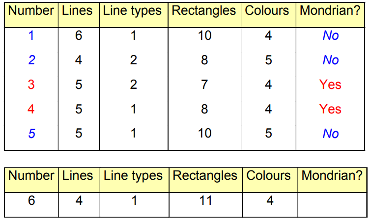
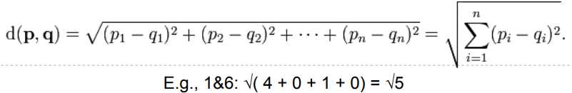

# K-NN Classification

[TOC]

## Classification Problem

Decide which class a particaular pattern belongs to on the basis of a set of requirements, typically the data tells us something about the patterns for each class

We need to construct a classifier from the training data that will tell us about a previously unseen pattern.

## Instance Based Learning

* One way of solving tasks of approximating discrete or real-valued target functions
* Have training data points
* Key idea:
  * Just store the training instances 
  * When a test instance is given then find the closest match or matches 
* “Lazy learning” = no training required 
  *  But no model actually learned!

## Nearest Neighbour Algorithm

### 1-NN

Given a test instance x~m~

* First locate the nearest training instance x~n~ then assign f(x~m~) to f(x~n~)

### K-NN

* Given a test instance x~m~
  * First locate the k nearest training instances
  * If they give conflicting opionins then go for the majority opinion
  * If they give numbers and they're different then take the mean value

* k =1
  * It's a square
* k = 3: 
  *  Belongs to triangle class 
* k = 7: 
  *  Belongs to square class

* Choosing the value of k: 
  * If k is too small, sensitive to ‘noisy’ points 
  * If k is too large, neighbourhood may include points from other classes
  * Choose an odd value for k, to eliminate ties

#### Perform 3-NN

* Perform the calculation for the data ser and find the 3 nearest data sets

* Take each corrosponding value away from each other and square root
* Quite often the data is normalised because otherwise it could be swayed by large number
  * This means taking the largest number and dividing every other number by it

### K-NN Algorithm

* Theoretical considerations… 

  * As k increases 
    * We are averaging over more neighbours 
    * The effective decision boundary is more “smooth” 
    * Too many neighbours and it becomes meaningless 
    * As n (number of data points) increases, the optimal k value tends to increase in proportion to log n 
      * E.g. 100 data points, k=2

  #### When to Consider k-NN

  * Not more than ~20 features 
    * Distance measure becomes less effective beyond this 
  * Lots of training data 
  * Advantages: 
    * Training is very fast 
    * Can learn complex target functions 
    * Don’t lose information 
    * Can handle outliers if k is sufficiently high 

#### Distance Weighted k-NN

* We might want to weight nearer neighbours more heavily
  * If so then we want to use all training members 
* Disadvantages
  * Have to calculate the distance of the test instance from all training instances 
    * = big computational overhead! 
  * There may be irrelevant features amongst the features – so may have to employ feature selection beforehand 
    * E.g. Flu diagnosis data, which includes features such as ‘Favourite TV program’...

