#Search

------

[TOC]

## Intro to Search

* The problem of search
  * Define the problem
  * Represent the problem spaces
    * Search trees
    * Graphs
  * Find solution by using a search algorithm

* Define the problem
  * Start state(s) 
    * The initial state
  * Goal state(s) 
    * Where you want to get to
  * State space
    * Search space
  * Operators for moving in the state space
    * Successor function or action
  * A function to test if goal state reached
  * A function to measure path cost

#####Start State

* Where is the problem starting from
  * e.g. chess
    * Starting with all pieces in their starting positions on the board

#####Goal State

* The end state
* What you want to achieve
  * e.g. Noughts or crosses
    * Played board with o's or x's as the winner

#####State Space

* All legal positions in the generated search tree from start state to goal state
* Generate state space by using goal state
* Covers all possible outcomes at each stage of a search
* e.g. chess
  * A search state might represent a board position

#####Operator for Moving In the Goal State Space

* Used to generate state space
* Moves that are valid in your search space
  * e.g. chess
    * Pawns can move forward either one square or two

##### Function to check if goal state reached

* Something to determine if the goal has been reached

##### Function to measure path cost

* To determine if this path is good or if there is a better one

#### Example function definition

* The chess problem
  * All board assignments give a huge state space
  * $10^{120}$ different solutions
  * Need help in choosing which move to make next because you can't try them all

##### Chess problem definition

* Start state
  * Initial board position
* Goal state
  * Checkmate (optimal) or stalemate
* State space
  * Set of all legal board positions
* Actions
  * Valid position moves
* Goal function
  * Is oppositions king in checkmate or stalemate
* Path cost function
  * Number of moves so far

#### Example Route Planning 

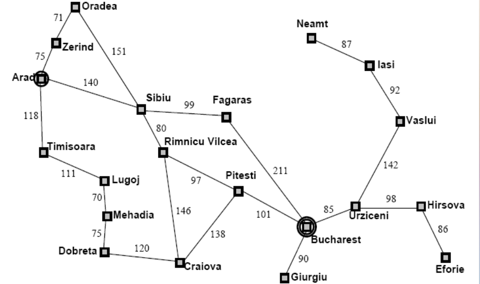

* Want to start in one position and travel somewhere else using shortest path

###### Problem Definiton

* Start state
  * Arod
* Goal state
  * Bucharest
* State space
  * Set of all possible Journeys (from Arod)
* Actions
  * Valid traversal from any two cities
* Goal function
  * Check to see ig you're at the destination
* Path cost function
  * Sum of the distance travelled

## Representing the Problem

* Data structures

  * Trees
    * Binary trees
    * Binary search trees
    * N-ary trees
  * Graphs

  ### Binary trees

  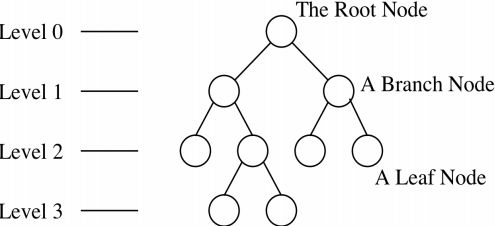

* Depth of 3

* Each circle is a node (snapshot state)

* Each line is a link

  * Legal move in state space as defined by operators

* Branching factor of 2

  * Because each node has two branches

  ### Binary Search Tree

  * Either it is empty or each node contains an identifier
  * All identifiers in the left sub-tree are less than the identifier in the root node 
  *  All identifiers in the right sub-tree are greater than the identifier in the root node 
  *  The left and right sub-trees are also binary search trees

###Search trees/N-ary trees 

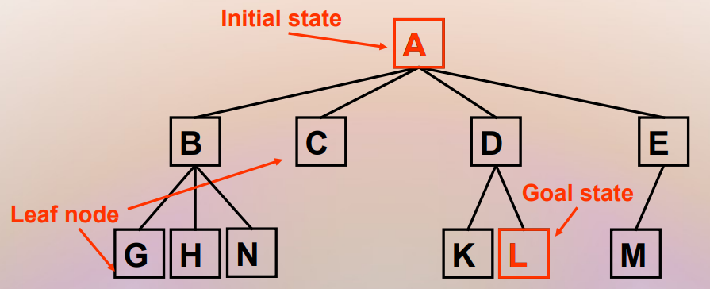

* Root is null state (or initial state)
* Edges represent one choice
  * Resulting from the operations
* Child states/nodes represent extensions
* Leaf states/nodes are solutions or failures

#### N-ary trees

* A node may have any number of children
* Most problems cannot be represented in a binary tree
* Most problems cannot be ordered for binary search
* Therefore, n-ary trees are usually used to represent search problems

#### Search trees

* Search algorithms do **not** store a whole search tree
  * Would require a **lot** of space
  * Can discard already explored nodes/states in search tree
  * if problem is a graph 
    * i.e. there are loops
      * Then we need to keep track of explored states
* Search algorithms store the frontier of search
  * i.e. the nodes in a search tree with some unexplored children

## Finding a soultion

* Search algorithms are used to find paths through state space from initial state to good state
  * Find ititial (or current) state
  * Check if **goal** found
    * **halt** if so
  * Use operators to expand all next nodes
  * Use search techniques to decide which one to pick next
    * Either use no information (uninformed/blind search) 
    * Or use information (informed/heuristic search)

### Representing the search

* Partial
  * Only store the frontier of search trees
    * Stack
    * Queue
    * Priority queue
* Full
  * Store the whole tree
    * Binary trees/n-ary trees
* A small finite state space can result in an infinite search tree
  * If there is a looping condition
  * This means the problem can't be solved

### The evaluation methods

#### Time complexity

* Number of nodes generated in a search
* Finite number searching infinite space
* Computational complexity
* Depends on branching factor and depth of the shallowest solution
  * The branching factor is equivalent to the the number of operators that are available at each level

#####Polynomial

* If time taken can be expressed as a polynomial
  * $an^4+bn^3+...+e$
  * $an^4$ is the largest part
  * in Big O expressed as O(n^4^)

##### Exponential

* t = 1, 10 computations 
* t = 2, 10 * 10 computations 
* t = 3, 10^3^ computations
* t = n, 10^n^ computations 
* Order of complexity O(10^n^ )

#### Space complexity

* The max number of nodes that can fit in memory

#### Optimality

* Is it guranteed that an optimal solution can be found

####Completeness

* If there is a solution available will it be found

## Uninformed Search

#### Algorithms

* Breadth-first
* Uniform-cost
* Depth-first
* Depth-limited
* Iterative deepening
* Bidirectional

### Breadth-first search

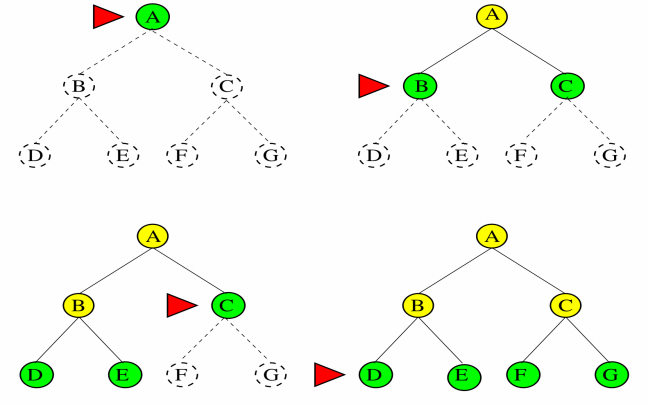

* Algorithm
  * Start at A, the root
    * Check if it's the goal
  * If it's not expand the children and generate the next level
  * Check if any of them are the goal
  * If not generate it's children and move on
* Use a queue

#### BFS example

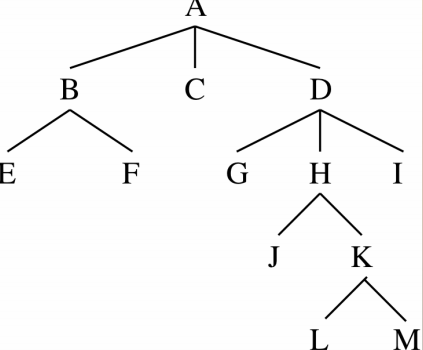

* Put A on queue 
* Examine A – not a solution 
* Remove from queue and place on HAVE-TRIED 
* Add B C and D to the back of queue 
* Repeat until solution found

#### Time and space complexity

* Consider a branching factor of b
  * Generate b nodes at level 1, b^2^ at level 2 etc...
  * Worst case the solution is at depth d
  * Worst case you would expand all but the last node
* Total number of nodes generated
  * b + b^2^ + b^3^ +... + b^d^ = O(b^d^)
  * Every node generated must remain in the memory as it's either in the frontier or an ancestor of a frontier node

#### Evaluation

* Is complete
  * Yes, providing branching factor b is finite
* Is optimal
  * Yes, if step costs are identical
* Has time and space complexity of O(b^d^)
  * Where d is the depth of shallowest solution
* Will find shallowest solution first
* Requires a lot of memory
* Can be very efficient if there are many equally good solutions

### Uniform-cost search

* Modifies breadth-first search
* Expands the lowest path cost rather than the shallowest unexplored node
* Dosen't track number of steps but rather the total cost
* Could get stuck in an infite loop if zero-cost action leads back to the same state

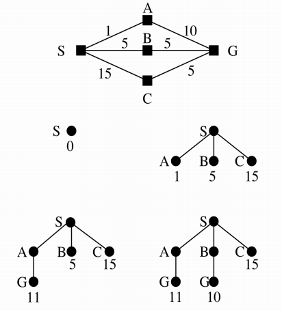

* Start at s
* see if it's the goal
* If it's not carry on
* We are looking for minimum value so put it in a priority queue and expand lowest value adding up cost as you go
* Identical to breadth first search is cost of all steps is equal 
* Guranteed complete and optimal if cost of every step is positive
* Finds the cheapest solution provided that the cost of every step is positive
* Finds the cheapest solution provided the cost of path never decreases (non-negative operators)
* If C* is cost of optimal solution and every action costs at least C
  * Worst case time and space complexity is O(b^1+C*/C^)
  * This can be much greater than b^d^ 
  * When all step costs are equal O(b^1+C*/C^) = b^d^

### Depth-first search

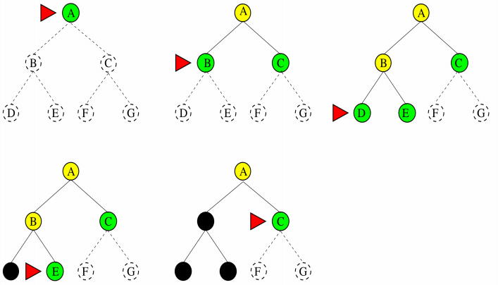

* Start at A
* Is it the goal
* If not expand and put children on a stack
* Move on examine B
* Not so put D and E on the stack and examine those

#### DFS example

* Put A on the stack
* Check if A is the solution
* It's not so pop it from the stack and place on HAVE_TRIED
* Push B, C and D onto stack
* Repeat untill solution found

#### General DFS Algorithm

* Put start node on stack
* Untill you have no more nodes on your stack
  * Examine the first node in the stack
    * If it's the solution stop
  * Add any children of node to stack

#### DFS evaluation

* Stores only a single path from the root to a leaf node and remaining unexplored sibling nodes for each node on the path
* Space requirement O(bm) for max depth
  * b is branching factor
* Time complexity O(b^m^)
* Can get stuck down the wrong path
* Some problems have very deep search trees
* Is neither complete nor optimal
* Should be avoided for problems with large or infinite maximum depths
* Main advantage is memory use

### Depth-limited search

* Avoids pitfalls of DFS
* Imposes a cut off on the max depth
* Not guranteed to find the shortest solution first
* If depth is too small search is not complete
* Complete if l(depth limit) >= d(depth of solution)
* Time complexity is O(b^l^)
* Space complexiatity is O(bl)

###Iterative Deepening Search

* Tries all possible depth limits in turn
* Solves the problem of deciding on the limit to set
* Combines the benefits of BFS and DFS
* Order of expansion is similar to DFS
* Some states are expanded multiple times

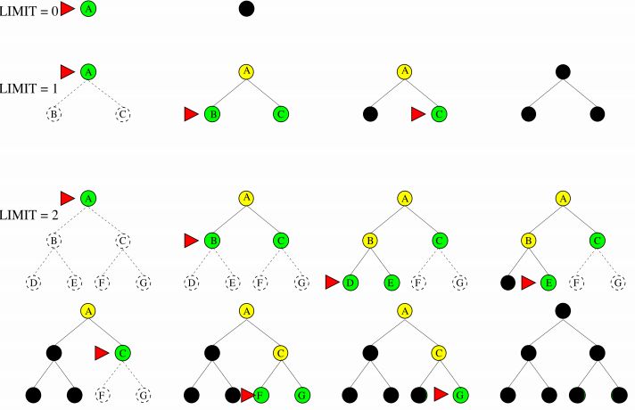

* Use depth limited search but iteratively increase limit untill a solution is found 
* Each time the depth is increased the stack is emptied
* IDS may seem wasteful as it's expanding nodes multiple times
  * But the overhead is small in comparison to the growth of an exponential search tree
* For large search spaces where the depth of the solution is not known then IDS is preferred

####IDS Evaluation

* Advantages
  * Is complete and finds optimal solutions
  * Finds shallow solutions first
  * Always has a small fontier
* Has time complexity O(b^d^)
* Nodes on bottom level are expanded once
* Those next to bot expand twice etc...
* Root expanded d times
* Has space complexity O(b^d^)

### Bidirectional Search

* Simultaneously search both forward from the initial point and backwards from the goal
* Stop when the two searches meet
* b^d/2^ + b^d/2^ is much less than b^d^

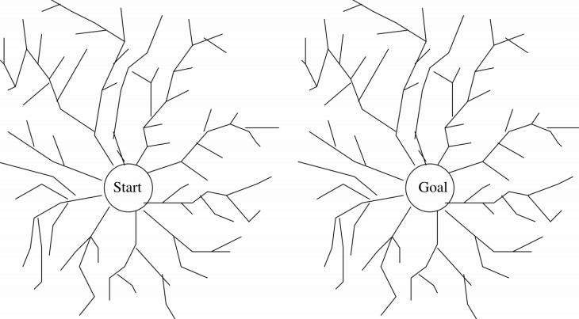

* Only need to go halfway in each direction
* Reduces time complexity O(b^d/2^)
* Need to store the whole tree for at least one direction
* Each new node is compared with all generated from the other tree in constant time using a hash table
* Increases space complexity O(b^d/2^)

### Uninformed Search Evaluation Table

| Criterion | Breadth First | Uniform Cost | Depth First | Depth Limited  | Iterative Deepening | Bi Directional |
| --------- | ------------- | ------------ | ----------- | -------------- | ------------------- | -------------- |
| Time      | b^d^          | b^1+(c*/c)^  | b^m^        | b^l^           | b^d^                | b^d/2^         |
| Space     | b^d^          | b^1+(c*/c)^  | bm          | bl             | bd                  | b^d/2^         |
| Optimal?  | Yes           | Yes          | No          | No             | yes                 | Yes            |
| Complete? | Yes           | Yes          | No          | Yes, if l >= d | Yes                 | Yes            |

 

## Heuristic Search

* A heuristic is a rule or principle used to guide a search 
* It provides a way of giving additional knowledge of the problem to the search
* Must provide a reasonably reliable extimate of how far a state is from a goal or the cost of reaching the goal via that state
* A heuristic evaluation function calculates such distances or costs

### Why Do We Need Heuristics?

* Large state spaces of possible solutions
* Exponentially based problems 
* Need to have practical ways of determining a solution
* Suitable for problems in which path cost is irrelevant

### Heuristics vs Algorithms

* A correct algorithm will find you the best solution given good data and enough time

  * It is precisely specified

* A heuristic gives you a workable solution in a reachable amount of time

  * It gives you a guided ot directed solution

  

### Evaluation Functions

* There are an infinite number of possible heuristics
* Criteria is that it returns an assessment of the point in the space
* If an evaluation function is accurate it will lead directly to the goal
* More realistically this usually ends up as "seemingly best search"
* Traditionally the lowest value after evaluation is chosen as we usually want the lowest cost or nearest
* Estimate of expected activity value from a current position e.g. value for pieces left in chess
* Way of judging the value of a position
* Humans have to do this as we do not evaluate all possible alternatives
* These heuristics usually come from years of human experience of playing a game

#### Requirements

* Computation must not take long
  * The function will be applied to every expanded state in the search
* Ideally should be:
  * Accurate
    * provide a reasonable estimate of the amount of work required to get to the goal
  * Close to perfect:
    * The closer the heurisitc estimate is to the actual cost of the goal, the better it is
  * Optimistic:
    * Rather than pessimistic i.e. think that it's closer to the goal than it actually is

Heuristics can be combined to create even better heuristics

### Example: The 8 Puzzle Problem

* Tile can be moved up, down, left and right
* Max branching factor 4 
* Depth of solution is 26
* Average solution cost is about 22 steps

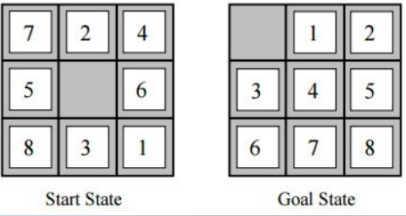

#### Heuristics

* Number of tiles out of place (h1)
* Manhatten distance (h2)
  * Sum of the distance of each tile from it's goal position
  * Tiles can only up, down, left and right which is like city blocks

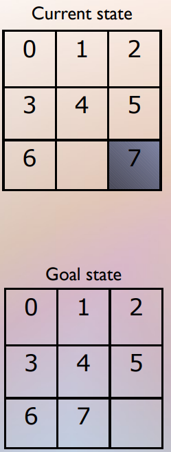

* h1 = 1

* h2 = 1

  * h2 doesn't take into account that you need yo move other tiles

  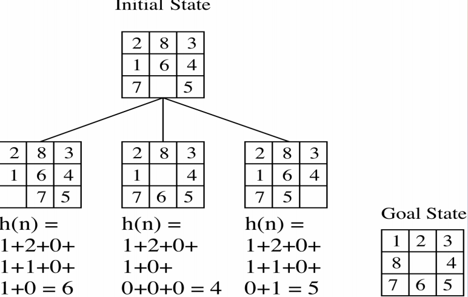

## Informed Search (Heuristic)

* Hill Climbing
* Best-first search
  * Greedy
  * A*

### Hill Climbing

* Consider all states are laid on the surface of a landscape

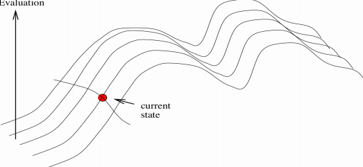

* We have a landscape with lots of points and each point corrosponds to the result of the evaluation function

#### Iterative Improvements

* Local search algorithms
* Paths typically not retianed so very little active memory is needed
* Move around the valeys trying to find the lowest valleys (optimal solutions)
* Useful for hard practical problems where the state description itself holds all the infomation needed for a solution
* Find reasonable solutions in a large or infinite state space

#### HIll Climbing Algorithm

* Start with current state = initial state
* Untill current state = goal state OR there is no change in current-state do:
  * Get the successor of current-state and apply evolution function to each successor 
  * If one if the successors has a better score than set new current-state to the successot with the best score
* Loop that moves in the direction of decreasing value
* Terminates when a dip is reached
* If there is more than one best direction then the algorithm will choose at random 
* Uses a priority list to put the best first

#### Drawbacks

* Local minima

  * Rather than global minima 

* Plateau

  * Area of state space where the evaluation function is essentially flat 
  * The search will conduct a random walk

* Ridges

  * A ridge may have deeply steeping sides
  * Causes problems when states along the ridge are not directly connected - the only choice at each point on the ridge requires uphill (downhill) movement

  

#### Random Restart Hill Climb

* Success of hill climb depends on shape of landscape
* Conducts a series of hill-climbing searches
* Start at randomly generated initial states
* Saves the result from any of the searches
* Can use fixed number of iterations or continue untill the best result does not change

### Best-first search 

* Differnet best-first strategies have different evolution functions
* Some use heuristics only, others use cost functions
  * f(n) = g(n)+h(n)
  * Where g(n) is a cost function 
  * h(n) is a heuristic function

#### BFS 

* Like hill climbing but eventually tries all paths as it uses list of nodes yet to be explored
  * This is the basis for most informed search methods
  * Uses a priority queue to order states on the basis of how promising they are 
* Start with priority queue = initial state
* While priority queue is not empty do:
  * Remove best node from priority queue
  * If it is the goal node return success otherwise find it's children 
  * Apply evaluation function to children and add to prioirty queue

### Greedy and A*

* Our heuristics for these are:
  * Heuristic function h(n) = estimated cost of the cheapest path from node A to a goal node
  * Our cost function g(n) = cost to reach current position in the search
  * For now we willintroduce the constraint that if n is a goal then h(n) = 0

#### Greedy Search/ Greedy BFS

* Tries to expand the node that is "closest" to the goal assuming that it will lead to a solution quickly 
  * f(n) = h(n)
    * i.e. g(n) path cost is not considered 
* Differs from hill climbing 
  * Allows back training 
* Implementation
  * Expand the "most desirable" node into the frontier queue
  * Sort the queue in increasing order

##### Example

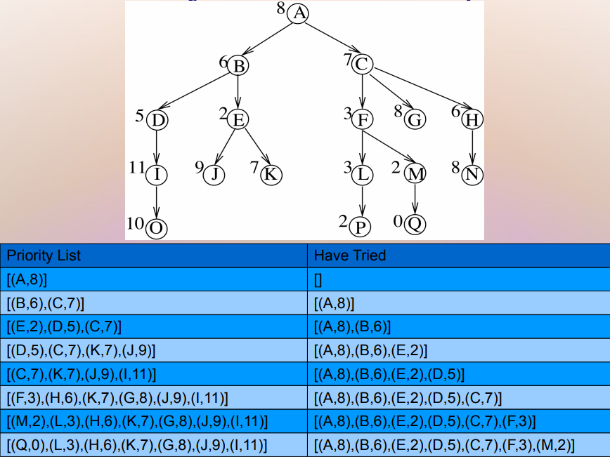

* Start at A
* Check if it's the goal
* Expand the nodes
* Choose lowest 

##### General Best First

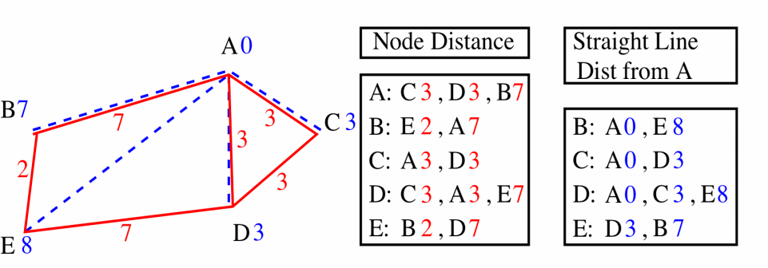

* Cost function g(n) = distancce travelled
* Heuristic evaluation function h(n) = straight line distance

##### Greedy Best First Search

* Choose the least cost node using h(n)
* If we start from R with goal A
  * Can travel to B (cost 7) or D (cost 3)
  * So D is chosen and B stored in case of back tracking
  * Nodes available from D are:
    * A (cost 0)
    * C (cost 3
    * E (cost 7)
  * Choose A and the goal is reached
  * So path is E,D,A
* Does not take into account the distance travelled to get to a low cost node
* Can easily end up with sub-optimal solutions
* Route found was E,D,A with distance cost 10
* E,B,A is shorter with distance of 9

#####Greedy Search Evaluation

* Does not always find the lowest cost solution 
* It is not optimal
* It is not complete
  * Same problem as depth-first 
* Time complexity of O(B^m^)
* Space complexity O(b^m^)
* With a good heursitic these can be reduced
  * Depends on the problem and the h(n) function

#### A\* Search/A* BFS Search

#####A* BFS Search

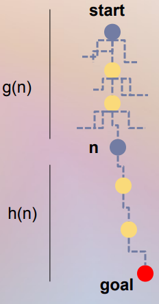

* Evaluates nodes by combining two costs
* g(n) 
  * The cost of getting tot he current point
  * Path cost from start node to node n
* h(n)
  * The cost to get from the node to the goal
  * Estimasted cost of the cheapest path from n to the goal
* Total path cost + straight line distance using g(n) + h(n)

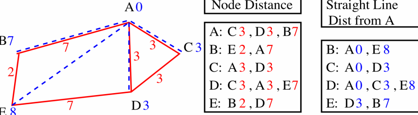

* If we start from E with goal node A
* From E
  * B = g(b) + h(b) = 2+7 = 9
  * D = g(D) + h(D) = 7+3 = 10
  * So B is selected
  * While remembering that f(D) = 10
* So we have trabelled from E to B with total cost f(n) = 9
* Continuing from B
  * A = g(A) + h(A) - 2+7+0 = 9
    * 0 because that the straight line distance and A is a distance of 0 from A
  * E = g(E) + h(E) =  2+2+8=12
  * A is a solution and lower than previous f(D) = 10
    * Search halted
    * Route found E,B,A

##### A* Search

* When h(n) = h*(n)
  * h*(n) is actual cost to goal
  * Only nodes in the current path are expanded
  * Optimal solution is found
* When h(n) < h*(n)
  * Additional nodes are expanded
  * Optimal solution is found
* When h(n) > h*(n)
  * Optimal solution can be overlooked

##### Evaluation

* Complete and optimal if h(n) does not overestimate the true cost of a solution through n
* Time complexity
  * Best case h(n) is perfect 
    * O(d)
  * Worst case h(n) = 0
    * O(b^d^)
* Space complexity
  * Keeps ll nodes in memory and safe in case of repetition 
    * O(b^d^)
    * A* Ususally runs out of memory before it runs out of time

### Non-admissible heuristics

* May sometimes overestimate the cost to the goal
  * So might not produce an optimal solution
* However the advantage is that sometimes a non-admissible heuristic expands much fewer nodes so can lead to good enough solutions very quickly

### Informedness

* Comparison of heurisitcs 
  * if h2(n) >= h1(n) for all n (and both underestimate the actual cost = admissible) then h2 is more informed than h1 and is better for search

### Which method?

* Uninformed search if no other infomation is availanle
* A* for medium sized spaces if heuristic knowledge is accceptable
* Hill climbing for discrete spaces where a sub-optimal solution is acceptable